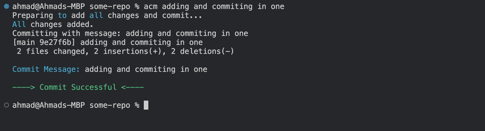
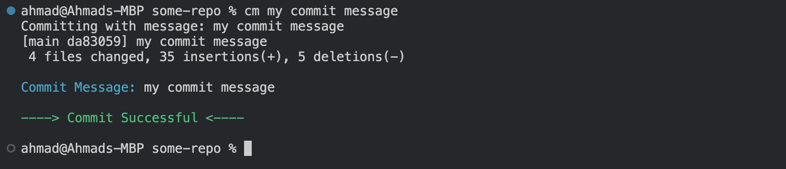

# ACP Quickly: Enhanced Git Integration for Efficient Workflow

**Latest Update: NEW FEATURE QUICK STATUS (Remote sync status bar)!!**

[Extension Link](https://marketplace.visualstudio.com/items?itemName=AhmadNYC.acp-git-commands)

This extension enhances your Git workflow by enabling the execution of add, commit, and push commands through a streamlined, single command interface. It simplifies the command process by removing the need for quotation marks around commit messages and reduces the complexity of Git commands, making them shorter and more intuitive.

- **Successful Push**

  

## Features

- **Efficient Git Operations**: Execute git add, commit, and push operations with a single command, directly from your editor, without the need for quotation marks.
- **Simple Commands**: Condenses traditional Git commands into shorter versions that are easier to type and remember, eliminating the need for quotation marks even in commit messages that include spaces or periods.
- **Real-Time Git Status**: Incorporates a dynamic status bar indicator that displays the current state of your Git repository. It provides immediate feedback if your branch is ahead, behind, or has diverged from the remote branch, enhancing your workflow by reducing the need to manually check the repository status.
- **Forced Remote Sync**: ACP command ensures that your local repository is synchronized with the remote before allowing any push operations, thus avoiding conflicts and ensuring a smooth workflow.
- **Customizable Commit Messages**: Allows you to directly type commit messages into the command line, streamlining the process of making quick updates or detailed logs.
- **Cross-Shell Compatibility**: Provides support across multiple shell environments including bash, zsh, and Windows Command Line, ensuring functionality across various development setups.

## Command Example Usage

Visual demonstrations of the extension in action:

- **Successful Push Above**

- **Commit Failed / Push Failed**

  

---

- **Pull Before ACP**

  - _Won't add or commit if pull needed._

  

---

  

    
<strong>Checks included within ACP important!</strong>

**Diverged from Remote**

- _When your local and remote branches have diverged, you must use separate git commands._

- 

**No Upstream Set**

- _Checks if your branch has an upstream set before ACP. If not, it instructs how to set one. Only within ACP command._

- 

**No Repository Found**

- 

**Extra**

- _Won't allow any Commands from a detached state._

## Quick Status - New Feature!

Introducing real-time Git status updates directly in your status bar (left side), keeping you informed of your repository's state without interrupting your workflow!

- **Up to Date**

  

---

- **Behind**

  

---

- **Ahead**

  

---

- **Diverged**

  

---

- **Not in a Repository**

  

---

_Updates could be delayed by up to 1 minute._

## More Commands -

_These don't force being in sync with remote only `ACP` does._

- **acm**

  - _Add all and commit._

  

---

- **cm**

  - _commit._

  

---

- **add**

  - _On default adds all files. Takes in query for files as well._

  ## 

  

## Installation

1. **Install the Extension**:
   Download and install the extension from the Visual Studio Code Marketplace.

2. **You should get a notification of success or error.**

3. **Restart Your Terminals**: To ensure the changes take effect, restart or refresh your terminal.

4. **Thats it!**

## Usage Warning

- **Special Characters**: The `All Commands` support commit messages without quotation marks for simple texts and spaces and `.,-_` . For including special characters (e.g., `!#^@&^@$@()&*&(!!!>:<{|}>`), you will still need to encapsulate the message in quotes like this:

- `acp` " !#^@&^@$@()& \*&()!!!>:<{|}> "

## Requirements

No additional requirements are needed for this extension except git duh, as it uses your existing git setup. Just restart or terminate your terminals after installation.

## Extension Settings

This extension does not require specific settings for basic operation but depends on your existing git configuration.

## Known Issues

1 Every VSCODE launch the first window will have update notification.- might be fixed.

2 Will be updating to only work on git repo folders/Files next.

## Release Notes

## 0.8.0 Release Notes

#### New Features and Enhancements:

- **Installation Fixes**: Fixed issue where user did not have a shell config file by creating one for them else update existing config.
- **Version Update**: Updated to version 0.8.0 to include new features such as the Quick Status.
- **Quick Status**: Added a new feature that provides real-time Git status updates directly in your status bar. This feature allows you to see at a glance whether your repository is ahead, behind, or diverged without running any commands.
- **Enhanced Compatibility**: Improved support for bash on macOS, ensuring that users can seamlessly use the extension in their preferred shell environment.
- **Performance Improvements**: Enhanced the overall performance of the extension, making it faster and more responsive when executing Git commands.
- **On Uninstall**: The commands will actually be removed from your shell config file.

  
<strong>Older Notes!</strong> 

  
## 0.7.0 Release Notes

### New Features and Enhancements:

- **Zsh Support**: Reintroduced support for Zsh shell across all platforms (Darwin, Linux, Windows), enhancing the tool's compatibility.
- **Improved Error Handling**: Refined error messages to provide clearer guidance and actions, particularly when the shell configuration file is not detected.
- **Add Command Enhancement**: New `add` command functionality allows for specific or all files to be staged with detailed feedback on the action's success.
- **ACM and Add Command Functionalities**: Updated `acm` and `add` commands to halt operations if no commit message is provided or if the repository is in a detached state.
- **Temporary File Assistance**: When no shell configuration file is found, the extension now creates a temporary editable file in VS Code with manual setup instructions instead of creating a physical file on the desktop.
- **Interface Improvements**: Enhanced markdown formatting for the extension's UI to better communicate the handling of different Git states and commands.

- **User Guides and Support**: Updated documentation to include new features and commands, ensuring users fully understand how to utilize the new functionalities.

### 0.6.0

- **New Feature**: Added error handling for commands run outside of Git repositories to enhance user feedback.

### 0.5.0

- **Version Checking**: Integrated version checking to ensure users always run the latest ACP command script.

### 0.4.0

- **Branch Sync Enhancements**: Enhanced the extension to handle local branch comparisons with remote, manage divergences, and ensure required pulls are made before pushing.

### 0.3.0

- **Automatic Updates**: Implemented automatic updates for the ACP function to synchronize with extension updates.

### 0.2.0

- **Detached Head and Upstream Handling**: Added handling for detached HEAD states and upstream branch settings, improving stability and usability.

### 0.1.0

- **Initial Release**: Set up the basic functionality of the ACP command, laying the foundation for future enhancements.

## For more information

- [My Github](https://github.com/AhmxdNYC)
- [My Linkedin](https://www.linkedin.com/in/ahmad-hamza-/)

**Enjoy using ACP Quickly! This tool is designed to make your coding and version control process smoother and faster.**

# GIT-ACP-Shortcut-Extension
