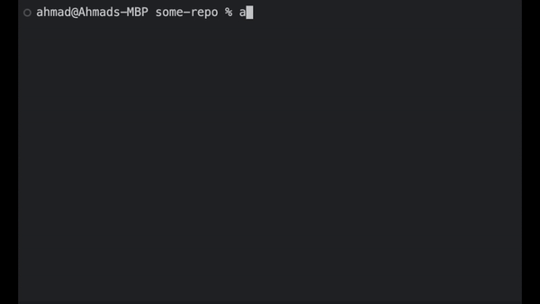
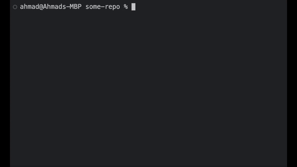
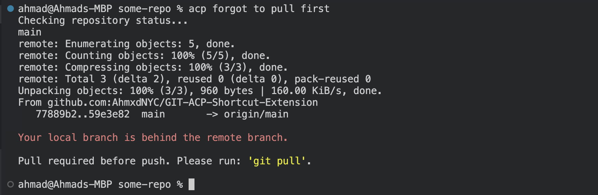
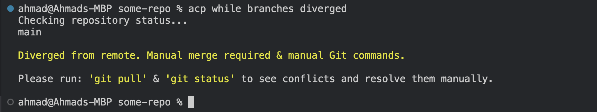
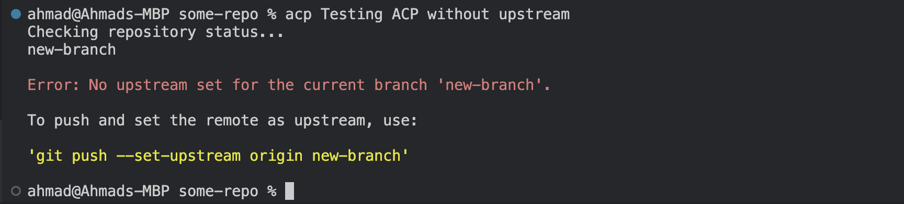
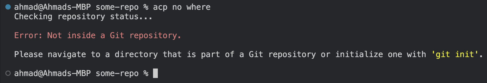
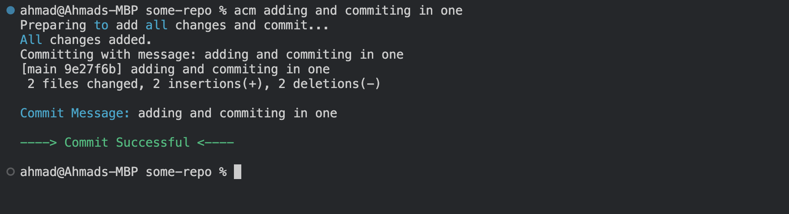
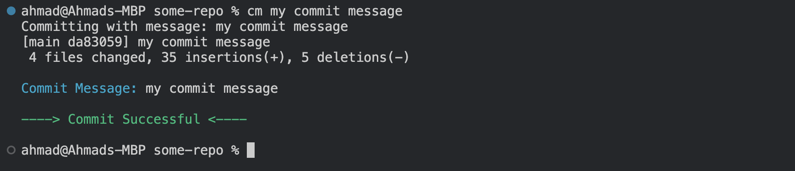

# ACP Quickly: Enhanced Git Integration for Efficient Workflow!

**Latest Update: v1.0.0 — TypeScript refactor, fish shell support, and bug fixes!**

[Extension Link](https://marketplace.visualstudio.com/items?itemName=AhmadNYC.acp-git-commands)

This extension enhances your Git workflow by enabling the execution of add, commit, and push commands through a streamlined, single command interface. It removes the need for quotation marks around commit messages and reduces Git commands to short, memorable aliases.

- **Successful Push**

  

## Features

- **Efficient Git Operations**: Execute git add, commit, and push with a single command or **keybind**, directly from your editor — no quotation marks needed.
- **Simple Commands**: Condenses traditional Git commands into shorter versions that are easier to type and remember, even for commit messages with spaces or punctuation.
- **Real-Time Git Status**: A dynamic status bar indicator shows whether your branch is ahead, behind, or diverged from the remote at a glance.
- **Forced Remote Sync**: The `acp` command checks that your local branch is in sync with remote before pushing, preventing conflicts.
- **Customizable Commit Messages**: Type commit messages directly on the command line — no quotes required for normal messages.
- **Cross-Shell Compatibility**: Full support for **bash**, **zsh**, and **fish**. The Quick Status indicator works in all environments regardless of shell.

## Shell Support

| Shell | Status |
|-------|--------|
| zsh | ✅ Supported |
| bash | ✅ Supported |
| fish | ✅ Supported (added in v1.0.0) |

If your shell is not auto-detected, set it manually under **Settings → ACP Git Commands → Shell Type**.

## Command Example Usage

- **Successful Push Above**

- **Commit Failed / Push Failed**

  

---

- **Pull Before ACP**

  - _Won't add or commit if a pull is needed._

  

---

  

    
<strong>Safety checks included in ACP</strong>

**Diverged from Remote**

- _When your local and remote branches have diverged, you must resolve it manually._

- 

**No Upstream Set**

- _ACP checks for an upstream before pushing and tells you exactly how to set one._

- 

**No Repository Found**

- 

**Extra**

- _No commands will run from a detached HEAD state._

## Quick Status

Real-time Git status in your status bar (bottom left), always visible without running any commands.

- **Up to Date** — 
- **Behind** — 
- **Ahead** — 
- **Diverged** — 
- **Not in a Repository** — 

_Status refreshes on file changes and window focus. Remote sync (fetch) runs every 5 minutes._

## Quick Push: Seamless ACP

A single keystroke types `acp` into your current terminal, or opens a new one if none is active.

### Keybindings

- **Mac**: `CMD` + `OPTION` + `P`
- **Windows/Linux**: `CTRL` + `ALT` + `P`
- **Change**: Keyboard Shortcuts → search `Quick Push`

## More Commands

_These do not enforce remote sync — only `acp` does._

- **acm** — Add all and commit.

  

---

- **cm** — Commit only (no add).

  

---

- **add** — Stage files. Adds all by default, or pass specific files.

  

  

## Installation

1. Install from the [VS Code Marketplace](https://marketplace.visualstudio.com/items?itemName=AhmadNYC.acp-git-commands).
2. Open any Git workspace — the extension activates automatically.
3. A success notification confirms the shell functions were installed.
4. That's it. Open a new terminal and run `acp your commit message`.

## Usage Warning

- **Special Characters**: All commands support commit messages without quotes for normal text, spaces, and common punctuation (`. , - _`). For special characters (e.g., `! # ^ @ & * ( ) > < { | }`), wrap the message in quotes:

  `acp "fix: resolve edge case with !important flag"`

## Requirements

Git must be installed. No other dependencies. Restart any open terminals after the first install so the shell functions are sourced.

## Extension Settings

| Setting | Default | Description |
|---------|---------|-------------|
| `acpGitCommands.shellType` | _(auto-detect)_ | Override shell detection. Options: `bash`, `zsh`, `fish`. |
| `gitStatus.fetchInterval` | `300000` | How often (ms) to fetch from remote for status bar. Set to `0` to disable. |

## Known Issues

None currently. Please open an issue on [GitHub](https://github.com/AhmxdNYC/GIT-ACP-Quickly-Extension) if you find one.

## Release Notes

## 1.0.0

#### TypeScript Refactor & Fish Shell Support

- **TypeScript**: Rewrote entire extension in TypeScript with strict mode. Codebase split into four focused modules (`extension`, `statusBar`, `shellConfig`, `shellScripts`).
- **Fish shell support**: Added full support for the fish shell. All four commands (`acp`, `acm`, `add`, `cm`) are available in idiomatic fish syntax. Config written to `~/.config/fish/config.fish` (directory created automatically if missing).
- **Shell setting now works**: The `acpGitCommands.shellType` VS Code setting is actually read and respected — previously it was ignored entirely.
- **Performance**: `git fetch` no longer runs on every file save or tab switch. Remote fetches happen only on the 5-minute interval; local status reads (`git status -sb`) handle all other updates.
- **Bug fixes**: Resolved duplicate `cm()` function definition in shell script, early-return in `activate()` that prevented the Quick Push command from registering on first install, double command registration, and double event listener subscription.

  
<strong>Older release notes</strong>

## 0.9.0

- **Quick Push**: Type `acp` into your terminal with a single keystroke (`CMD+OPT+P` / `CTRL+ALT+P`) or via the command palette.
- **Activation Optimization**: Extension now activates only within Git workspaces.
- **Terminal Optimization**: The `acp` command is prepared in the active terminal without closing it.
- **Custom Terminal Names**: Terminals reopen with their original names after a config update.

## 0.8.0

- **Installation Fixes**: Creates a shell config file if one doesn't exist.
- **Quick Status**: Real-time Git status in the status bar — ahead, behind, or diverged at a glance.
- **Enhanced Compatibility**: Improved bash support on macOS.
- **On Uninstall**: ACP functions are removed from your shell config on extension uninstall.

## 0.7.0

- **Zsh Support**: Reintroduced Zsh support across all platforms.
- **Improved Error Handling**: Clearer guidance when shell config is not detected.
- **Add Command Enhancement**: `add` can now stage specific files with detailed feedback.
- **Temporary File Assistance**: When no config file is found, instructions open in a VS Code editor tab instead of writing to the desktop.

### 0.6.0

- Added error handling for commands run outside of Git repositories.

### 0.5.0

- Version checking to ensure users always run the latest ACP script.

### 0.4.0

- Enhanced branch sync — handles divergence and enforces pulls before pushing.

### 0.3.0

- Automatic updates for the ACP shell function on extension update.

### 0.2.0

- Detached HEAD and upstream branch handling.

### 0.1.0

- Initial release.

## For more information

- [GitHub](https://github.com/AhmxdNYC/GIT-ACP-Quickly-Extension)
- [My GitHub Profile](https://github.com/AhmxdNYC)
- [My LinkedIn](https://www.linkedin.com/in/ahmad-hamza-/)

**Enjoy using ACP Quickly — designed to make version control faster and less friction.**
