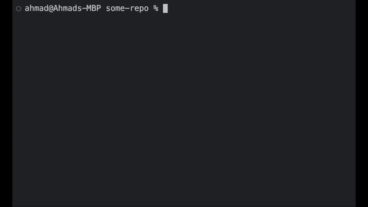
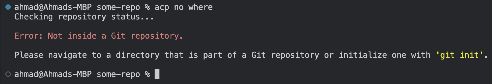

# ACP Quickly: Git Add, Commit & Push with a Single Command. No ""

[Extension Link](https://marketplace.visualstudio.com/items?itemName=AhmadNYC.acp-git-commands)

This extension streamlines the git workflow by enabling you to add, commit, and push changes with a single command, without the need for quotation marks.

- **Successful Push**

  

## Features

- **Efficient Git Operations**: Perform git add, commit, and push operations with a single command directly from your editor.
- **Forced Remote Sync**: Automatically ensures you're up-to-date with the remote repository before allowing pushes, keeping your workflow smooth and conflict-free.
- **Customizable Commit Messages**: Directly type commit messages into the command, enabling quick updates and clear logs.
- **Cross-Shell Compatibility**: Supports bash, zsh, and Windows Command Line, making it versatile across different environments.

## Example Usage

Visual demonstrations of the extension in action:

- **Successful Push Above**

- **Commit Failed / Push Failed**

  

- **Pull Before ACP**
- _Won't add or commit if pull needed._

  

- **Diverged from Remote**
- _When your local and remote branches have diverged, Must use normal git commands._

  

- **No Upstream Set**
- _checks if your branch has an upstream set before ACP. If not, it instructs how to set one._

  

- **No Repository Found**

  

- **Extras**
- _Won't allow ACP from a detached state_.

## Installation

1. **Install the Extension**: Download and install the extension from the Visual Studio Code Marketplace.
2. **Restart Terminals**:

3. **Thats it!**

## Usage Warning

- **Special Characters**: The `acp` command supports commit messages without quotation marks for simple texts. For including special characters (e.g., `!#^@&^@$@()&*&(!!!>:<{|}>`), you will still need to encapsulate the message in quotes like this:

- acp " !#^@&^@$@()& \*&()!!!>:<{|}> "

## Requirements

No additional requirements are needed for this extension except git duh, as it uses your existing git setup. Just restart or terminate your terminals after installation.

## Extension Settings

This extension does not require specific settings for basic operation but depends on your existing git configuration.

To fully **remove** or **edit** the extension code, go into the config (zshrc or bash) file and delete the code for the acp function.

## Known Issues

No known issues at this time. Please contact me with any issues you are experiencing.

## Release Notes

### 0.6.0

- **New Feature**: Added error handling for commands run outside of Git repositories to enhance user feedback.

### 0.5.0

- **Version Checking**: Integrated version checking to ensure users always run the latest ACP command script.

### 0.4.0

- **Branch Sync Enhancements**: Enhanced the extension to handle local branch comparisons with remote, manage divergences, and ensure required pulls are made before pushing.

### 0.3.0

- **Automatic Updates**: Implemented automatic updates for the ACP function to synchronize with extension updates.

### 0.2.0

- **Detached Head and Upstream Handling**: Added handling for detached HEAD states and upstream branch settings, improving stability and usability.

### 0.1.0

- **Initial Release**: Set up the basic functionality of the ACP command, laying the foundation for future enhancements.

## For more information

- [My Github](https://github.com/AhmxdNYC)
- [My Linkedin](https://www.linkedin.com/in/ahmad-hamza-/)

**Enjoy using ACP Quickly! This tool is designed to make your coding and version control process smoother and faster.**

# GIT-ACP-Shortcut-Extension
