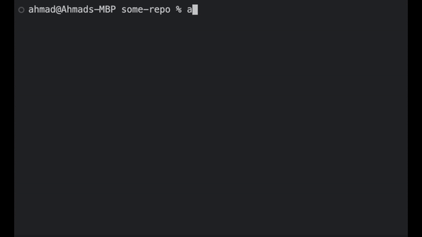

# ACP Quickly: Git Add, Commit & Push with a Single Command. No ""

[Extension Link](https://marketplace.visualstudio.com/items?itemName=AhmadNYC.acp-git-commands)

This extension streamlines the git workflow by enabling you to add, commit, and push changes with a single command, without the need for quotation marks.

- **Successful Push**

  

## Features

- **Efficient Git Operations**: Perform git add, commit, and push operations with a single command directly from your editor.
- **Forced Remote Sync**: Automatically ensures you're up-to-date with the remote repository before allowing pushes, keeping your workflow smooth and conflict-free.
- **Customizable Commit Messages**: Directly type commit messages into the command, enabling quick updates and clear logs.
- **Cross-Shell Compatibility**: Supports bash, zsh, and Windows Command Line, making it versatile across different environments.

## Example Usage

Visual demonstrations of the extension in action:

- **Successful Push Above**

- **Commit Failed / Push Failed**

  

---

- **Pull Before ACP**

  - _Won't add or commit if pull needed._

  

---

  

    
<strong>Checks included within ACP important!</strong>

**Diverged from Remote**

- _When your local and remote branches have diverged, you must use separate git commands._

- 

**No Upstream Set**

- _Checks if your branch has an upstream set before ACP. If not, it instructs how to set one. Only within ACP command._

- 

**No Repository Found**

- 

**Extra**

- _Won't allow any Commands from a detached state._

## More Commands -

_These don't force being in sync with remote only `ACP` does._

- **acm**

  - _Add all and commit._

  

---

- **cm**

  - _commit._

  

---

- **add**

  - _On default adds all files. Takes in query for files as well._

  ## 

  

## Installation

1. **Install the Extension**:
   Download and install the extension from the Visual Studio Code Marketplace.

2. **You should get a notification of success or error.**

3. **Restart Your Terminals**: To ensure the changes take effect, restart or refresh your terminal.

4. **Thats it!**

## Usage Warning

- **Special Characters**: The `All Commands` support commit messages without quotation marks for simple texts and spaces. For including special characters (e.g., `!#^@&^@$@()&*&(!!!>:<{|}>`), you will still need to encapsulate the message in quotes like this:

- `acp` " !#^@&^@$@()& \*&()!!!>:<{|}> "

## Requirements

No additional requirements are needed for this extension except git duh, as it uses your existing git setup. Just restart or terminate your terminals after installation.

## Extension Settings

This extension does not require specific settings for basic operation but depends on your existing git configuration.

To fully **remove** or **edit** the extension code, go into the config by doing `code . ShellFileExactName` file and delete the code for the acp function. Don't forget shell name can include special characters.

## Known Issues

No known issues at this time. Please contact me with any issues you are experiencing.

## Release Notes

  
<strong>Notes!</strong> 

## 0.7.0 Release Notes

### New Features and Enhancements:

- **Zsh Support**: Reintroduced support for Zsh shell across all platforms (Darwin, Linux, Windows), enhancing the tool's compatibility.
- **Improved Error Handling**: Refined error messages to provide clearer guidance and actions, particularly when the shell configuration file is not detected.
- **Add Command Enhancement**: New `add` command functionality allows for specific or all files to be staged with detailed feedback on the action's success.
- **ACM and Add Command Functionalities**: Updated `acm` and `add` commands to halt operations if no commit message is provided or if the repository is in a detached state.
- **Temporary File Assistance**: When no shell configuration file is found, the extension now creates a temporary editable file in VS Code with manual setup instructions instead of creating a physical file on the desktop.
- **Interface Improvements**: Enhanced markdown formatting for the extension's UI to better communicate the handling of different Git states and commands.

- **User Guides and Support**: Updated documentation to include new features and commands, ensuring users fully understand how to utilize the new functionalities.

### 0.6.0

- **New Feature**: Added error handling for commands run outside of Git repositories to enhance user feedback.

### 0.5.0

- **Version Checking**: Integrated version checking to ensure users always run the latest ACP command script.

### 0.4.0

- **Branch Sync Enhancements**: Enhanced the extension to handle local branch comparisons with remote, manage divergences, and ensure required pulls are made before pushing.

### 0.3.0

- **Automatic Updates**: Implemented automatic updates for the ACP function to synchronize with extension updates.

### 0.2.0

- **Detached Head and Upstream Handling**: Added handling for detached HEAD states and upstream branch settings, improving stability and usability.

### 0.1.0

- **Initial Release**: Set up the basic functionality of the ACP command, laying the foundation for future enhancements.

## For more information

- [My Github](https://github.com/AhmxdNYC)
- [My Linkedin](https://www.linkedin.com/in/ahmad-hamza-/)

**Enjoy using ACP Quickly! This tool is designed to make your coding and version control process smoother and faster.**

# GIT-ACP-Shortcut-Extension
